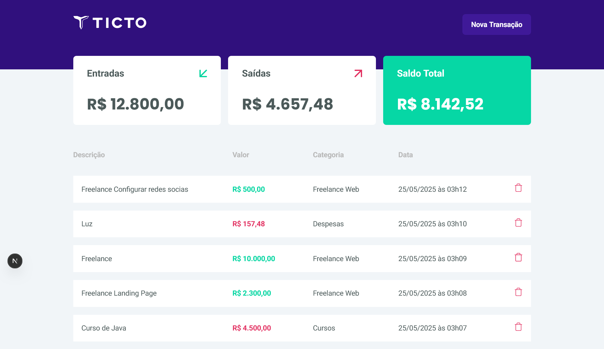
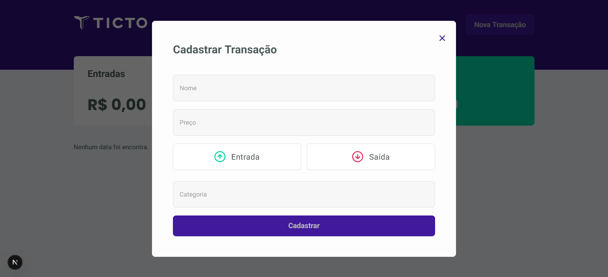
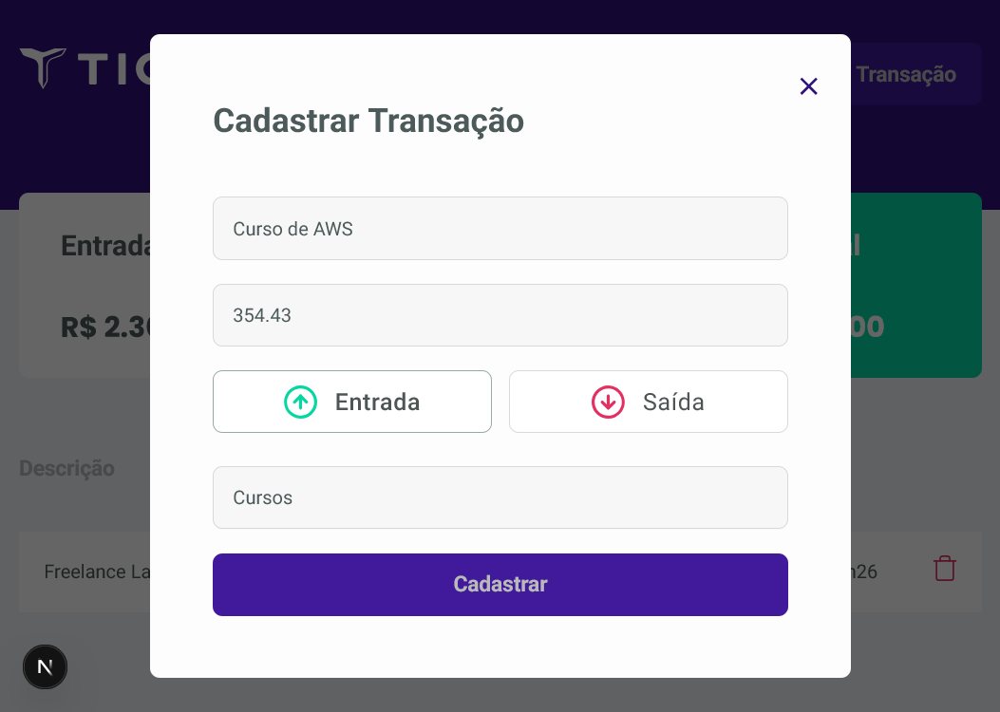
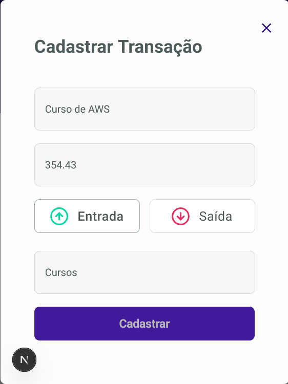

# Sistema de Controle Financeiro Pessoal

 

 Um sistema simplificado para controle de finanças pessoais, com visualização rápida de entradas, saídas e saldo total, além de gerenciamento completo de lançamentos.

 # Funcionalidades Principais

 ### Visão Geral Financeira

  -  Cards resumidos:

      -  📈 Entradas: Total de ganhos

      -  📉 Saídas: Total de despesas

      -  💰 Saldo Total: Diferença entre entradas e saídas

### Gerenciamento de Lançamentos

  - 📋 Listagem completa de todos os registros financeiros

  -  ➕ Adicionar novos lançamentos através de formulário

  -  ❌ Excluir registros individualmente

### Design Responsivo e Usabilidade
  - Desktop
  - Tablet
  - Mobile

### Tecnologias Utilizadas

  -  Frontend: Next.js 15, React 19, TypeScript

  -  Estilização: SCSS / SASS

  -  Gerenciamento de Estado: Server Routers

  -  Formulários: React Hook Form

  -  Ícones: SVG ou similar

  -  Build: Next.js

  ### Componentes Principais

  1. SummaryCards: Exibe os três cards com totais financeiros

  2. TransactionForm: Modal para adicionar novos lançamentos

  3.  TransactionsList: Tabela com todos os registros

  4.  TransactionItem: Componente individual para cada lançamento

  5.  DeleteButton: Botão para remover lançamentos

  ### Apresentação
  Desktop
  
  

  Tablet
  
  
  

  Mobile

### Como Contribuir

  1.  Faça um fork do projeto

  2.  Crie uma branch para sua feature (git checkout -b feature/awesome-feature)

  3.  Commit suas mudanças (git commit -m 'Add some awesome feature')

  4.  Push para a branch (git push origin feature/awesome-feature)

  5.  Abra um Pull Request

### Licença

Este projeto está licenciado sob a licença MIT - veja o arquivo [LICENSE]() para detalhes.

### Screenshots
Visão Geral	  Formulário de Lançamento
--
Visão Geral	Formulário
--

### Próximas Melhorias

  -  Adicionar gráficos de evolução mensal

  -  Implementar categorias personalizadas

  -  Adicionar filtros por período

  -  Criar relatórios em PDF

Desenvolvido com ❤️ por [André Ezequiel]("https://www.linkedin.com/in/andreezequiel/") - [andrelucasmartins@hotmail.com](mailto:andrelucasmartins@hotmail.com)